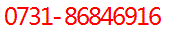
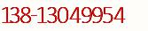
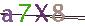
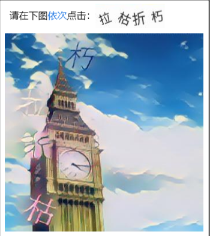
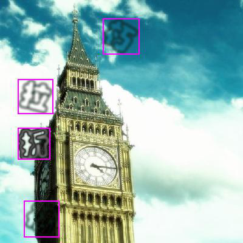

# any-captcha
generate any type of captcha with one config.  
一套配置，一行代码，快速生成任意风格验证码。

## 功能简述
  通过简单的配置，可以快速生成大部分类型的验证码，旨在解决机器学习训练样本难以获取的问题，几乎可以0成本获取样本。
  同时易于保存和修改，便于多次测试寻求最佳训练样本参数。更可以获取字符在验证码中的位置信息，适用于定位方面的项目。
  温馨提示：搭配以下在线工具使用效率更佳：  
  * 字体查找：http://www.qiuziti.com/  
  * 颜色查找：http://tools.jb51.net/color/colorpicker 
  
## 目录结构  
any-captcha
> configs: 存放配置文件  
> model: 项目源码  
> output: 默认验证码保存目录  
> resources
>>  background: 默认背景图片目录   
>>  corpus: 默认字符文本目录   
>>  font: 默认字体目录  
>>  markdown: md需要的资源

## CONFIG参数说明
* <code>texts</code>:  字符串数组，验证码上可显示的所有字符的集合，如果：  
  1. 数组长度大于1，每个元素能且只能是普通字符串（非文件和文件夹路径），且每个元素作为整体随机的显示在验证码中，
  此时<code>num</code>参数失效，每张验证码的字符个数由当前元素长度决定；  
  2. 数组长度等于1，此元素可以是： 
        * <b>文件路径</b>：将文件中的每一行作为一个元素存储到数组中，然后按照1.处理；  
        * <b>普通字符串</b>：则随机选取<code>num</code>个字符显示在每个验证码中。  
   *注：<b>暂不支持文件夹路径</b>。 
   
* <code>fonts</code>: 字符串数组，验证码字体文件（.ttf或.ttc,不区分大小写）路径的集合，如果：  
  1. 数组长度大于1，每个元素能且只能是字体文件的路径；
  2. 数组长度等于1，此元素可以是单个字体文件的路径，或者存放字体的文件夹路径。  
  
* <code>sizes</code>:  整型数组，验证码中字号大小的集合。  

  
* <code>bgs</code>:  字符串数组，验证码的背景图片或者颜色的集合，如果：  
  1. 数组长度大于1，每个元素可以是<code>【单张背景图片路径，单个背景颜色（格式同<code>colors</code>参数）】
  </code>中的一个；
  2. 数组长度等于1，此元素可以是<code>【单张背景图片路径，单个背景颜色，存放多张背景图片的文件夹路径，
  存放多个背景颜色值的txt文件路径（每行一个颜色值）】</code>中的一个；  
     
* <code>rotate</code>:  整型，验证码中单个字符可旋转角度的值，旋转角度的范围[-<code>rotate</code>, 
<code>rotate</code>]，每次随机取值。  
  
* <code>num</code>:  整型， 验证码显示的字符个数，具体参见<code>texts</code>参数。   
  
* <code>dot</code>:  整型，验证码中随机噪点的个数，默认（0）不显示噪点，如果有特定噪点需求，
推荐使用<code>CaptchaFactory.generate_captcha()</code>中的<code>bg_custom_fns</code>参数自定义。  
  
* <code>curve</code>: 整型，验证码中随机干扰线的个数，默认（0）不显示干扰线，如有特殊需求同<code>dot</code>。  
  
* <code>width</code>:  整型，验证码的宽度。   
  
* <code>height</code>:  整型，验证码的高度。    
  
* <code>align</code>:  整型，验证码的对齐方式，取值1或2, 其中1为左对齐，2为两端对齐。  
  
* <code>offset_ver</code>:  整型，验证码中单个字符的垂直偏移量，默认（0）垂直居中，如果 
<code>offset_ver > 0</code>, 随机从[-<code>offset_ver</code>, <code>offset_ver</code>]中选取一个偏移量。    
  
* <code>offset_hor</code>:  整型，验证码中单个字符的水平偏移量，默认（0）与前一个相接，如果 
<code>offset_hor > 0</code>, 随机从[-<code>offset_hor</code>, <code>offset_hor</code>]中选取一个偏移量。 
  
* <code>char_tran</code>:  浮点型数组，验证码中字符可选的透明度集合，单个元素取值范围[0.0,100.0]。    

<p>*注：以上参数都可以被<code>CaptchaFactory.generate_captcha()</code>方法中的相关参数覆盖，即可以动态指
定每一个参数，适用于需要遍历所有字符的情况。</p>
   

## 样例代码
### 目标验证码：http://www.58guakao.com/user/487549.html
### config:
```json
{
  "texts": [
    "resources/corpus/common_chinese.txt"
  ],
  "fonts": [
    "resources/font/PingFang_A.ttf",
    "resources/font/STXINWEI.TTF"
  ],
  "sizes": [
    38,40,42
  ],
  "colors": [
    "0x32678b",
    "0xe61514",
    "0x3e0ac3"
  ],
  "bgs": [
    "0xfef6f6",
    "resources/background/color.jpg"
  ],
  "rotate": 30,
  "num": 4,
  "dot": 0,
  "curve": 0,
  "width": 200,
  "height": 60,
  "align": 2,
  "offset_ver": 5,
  "offset_hor": 6,
  "char_tran": [
    5.97
  ]
}
```
### main code:
```python
def main():
    project_name = "demo"
    with open("configs/%s.json" % project_name, encoding="utf-8") as fp:
        demo_config = json.load(fp)

    demo_factory = CaptchaFactory(**demo_config)
    index = 3
    while index:
        captcha = demo_factory.generate_captcha()
        captcha.save("output/%s/%s.jpg" % (project_name, captcha.text))
        print(captcha.text, captcha.num)

        index -= 1
```
### 输出:
* 
*   

其他完整样例见<code>58gua_kao_factory.py</code>、<code>icp_factory.py</code>、<code>jingdong_factory.py</code>.

## 效果比对 

原始验证码 | 生成验证码     
| :-----: | :-----: |    
|  |  |  
|  |  |  
|  |  |  
|  |  |  

## 高级功能
### 自定义噪点/干扰线
此项目只提供了简单生成随机噪点或干扰先的方法，如有需要，可以通过简单配置config中<code>dot</code>或
<code>curve</code>生成。但更多时候，验证码中的干扰线和噪点都是需要自定义的，所以在
<code>CaptchaFactory</code>的构造方法中提供了以下两个参数，用于接收相关的回调函数：  
* <code>char_custom_fns</code>：如果对于单个字符有其他自定义操作，比如拉伸形变、膨胀腐蚀等，
可以通过此参数传入回调函数，支持多个回调函数随机调用。  
```python
def char_custom_fn(single_char):
    # do something you wanted
    # return single_char.filter(ImageFilter.GaussianBlur)
    return single_char
```
* <code>bg_custom_fns</code>：如果对于验证码背景有其他自定义操作，比如高斯模糊、指定样式的噪点或干扰线等，
可以通过此参数传入回调函数，支持多个回调函数随机调用。 
```python
def bg_custom_fn(bg):
    # do something you wanted
    # return bg.filter(ImageFilter.GaussianBlur)
    return bg
```  
详细代码见<code>jingdong_factory.py</code>.
### 字符位置：  
可以通过<code>Captcha.char_pos()</code>方法获取单个字符在验证码中的位置信息，返回一个四元组(x,y,w,h)，
分别表示左上角x坐标,y坐标,宽,高，适用于物体检测，文字定位等问题。  
样例：
```python
captcha = demo_factory.generate_captcha()
char_pos = captcha.char_pos
    width = captcha.width
    height = captcha.height
    with open(os.path.join(output_path, txt_out), "w", encoding="utf-8") as fp:
        for pos in char_pos:
            x, y, w, h = pos
            # 转化为中心点的坐标
            # x = (x + w / 2) * 1.0 / width
            # y = (y + h / 2) * 1.0 / height
```
## TODO  


